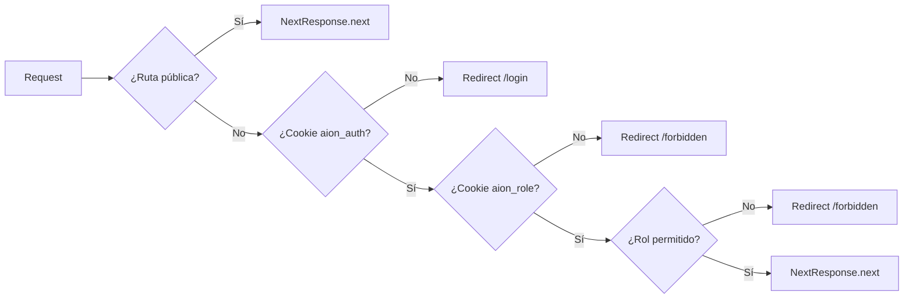

# Flujo de Autorización — Aion

## Arquitectura de 3 Capas

```
REQUEST → [ Middleware (Edge) ] → [ Root Page ] → [ DashboardLayout ] → Página protegida
                │                       │                  │
                │ cookie + rol           │ user + rol       │ user + rol
                ▼                       ▼                  ▼
           Redirect /login        Redirect /login      Redirect /login
           o /forbidden           o /forbidden         o /forbidden
```

## Capa 1: Middleware (Server-Side Edge)

**Archivo:** `apps/*/middleware.ts`



### Rutas Públicas

| App | Rutas públicas |
|-----|---------------|
| doctor-dashboard | `/login`, `/forbidden`, `/_next`, `/favicon`, `/api` |
| patient-portal | `/login`, `/forbidden`, `/_next`, `/favicon` |
| admin-panel | `/login`, `/forbidden`, `/_next`, `/favicon` |

### Mapa de Rutas por Rol

**doctor-dashboard** (`apps/doctor-dashboard/middleware.ts`):
```ts
const ROUTE_ROLES = {
  '/dashboard': ['doctor', 'receptionist', 'nurse'],
  '/patients': ['doctor', 'receptionist', 'nurse'],
  '/appointments': ['doctor', 'receptionist', 'nurse'],
  '/encounters': ['doctor', 'receptionist', 'nurse'],
  '/calendar': ['doctor', 'receptionist', 'nurse'],
  '/profile': ['doctor', 'receptionist', 'nurse'],
  '/settings': ['doctor', 'receptionist', 'nurse'],
};
```

**patient-portal** (`apps/patient-portal/middleware.ts`):
```ts
const ROUTE_ROLES = {
  '/dashboard': ['patient'],
  '/appointments': ['patient'],
  '/profile': ['patient'],
};
```

**admin-panel** (`apps/admin-panel/middleware.ts`):
```ts
const ROUTE_ROLES = {
  '/dashboard': ['admin'],
};
```

## Capa 2: Root Page (Client-Side)

**Archivo:** `apps/*/app/page.tsx`

Cada app tiene un `useEffect` que:
1. Espera a que `loading` termine
2. Si no hay `user` → `router.replace('/login')`
3. Si el rol no es el esperado → **no hace nada** (se queda en spinner, el middleware ya redirigió)
4. Si el rol es correcto → `router.replace('/dashboard')`

## Capa 3: DashboardLayout (Client-Side)

**Archivo:** `apps/*/app/dashboard/DashboardLayout.tsx`

Cada DashboardLayout verifica:
1. Si `loading` está activo → espera
2. Si no hay `user` → `router.replace('/login')`
3. Si el `user.roles` no contiene un rol permitido → `router.replace('/forbidden')`
4. Si pasa ambas verificaciones → `setReady(true)` y renderiza el contenido

## Matriz de Permisos Final

| Recurso FHIR | Doctor | Recepción | Enfermería | Paciente | Admin |
|-------------|--------|-----------|------------|----------|-------|
| Patient | ✅ R/W | ✅ R/W | ✅ R/W | ✅ R (solo propio) | ✅ R/W |
| Appointment | ✅ R/W | ✅ R/W | ✅ R/W | ✅ R/W (solo propios) | ✅ R/W |
| Encounter | ✅ R/W | ✅ R/W | ✅ R/W | ❌ | ✅ R/W |
| Practitioner | ✅ R (solo perfil) | ✅ R (solo perfil) | ✅ R (solo perfil) | ❌ | ✅ R/W |
| Observation | ✅ R/W | ❌ | ✅ R/W | ✅ R (solo propios) | ✅ R/W |
| DiagnosticReport | ✅ R/W | ❌ | ❌ | ✅ R (solo propios) | ✅ R/W |
| MedicationRequest | ✅ R/W | ❌ | ❌ | ✅ R (solo propios) | ✅ R/W |
| CarePlan | ✅ R/W | ❌ | ❌ | ❌ | ✅ R/W |
| Organization | ❌ | ❌ | ❌ | ❌ | ✅ R/W |

## Cookies de Sesión

| Cookie | Propósito | Seteada por | Accesible por |
|--------|-----------|------------|---------------|
| `aion_auth` | Indica sesión activa | `AuthProvider.login()` | Middleware (Edge) |
| `aion_role` | Roles del usuario (`,`-separated) | `AuthProvider.login()` | Middleware (Edge) |
| `medplum:activeLogin` | Token de acceso Medplum | MedplumClient (localStorage) | Solo cliente |

## Agregar un Nuevo Rol

1. Definir el rol en `packages/domain/src/types.ts` → `UserRole`
2. Agregar detección en `packages/auth/src/utils.ts` → `detectRoles()`
3. Agregar label en `packages/domain/src/types.ts` → `ROLE_LABELS_SHORT`
4. Agregar ruta en el middleware de la app correspondiente → `ROUTE_ROLES`
5. Agregar verificación en el DashboardLayout → `allowedRoles`
6. Agregar `AccessPolicy` en `infra/medplum/access-policies.json`
